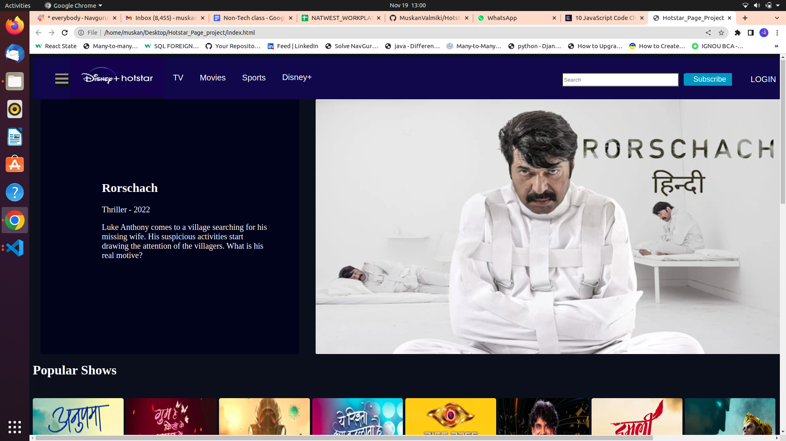
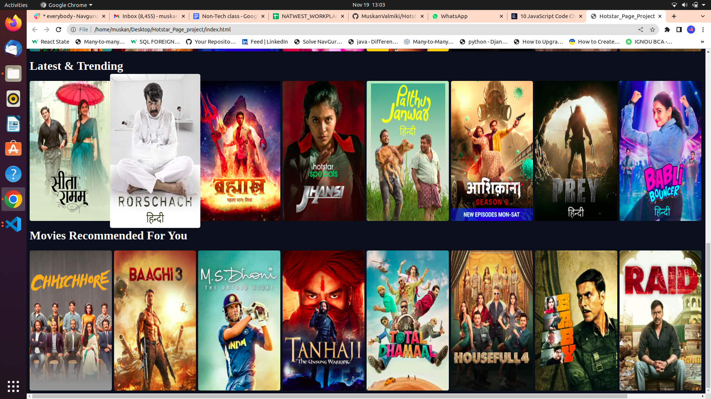
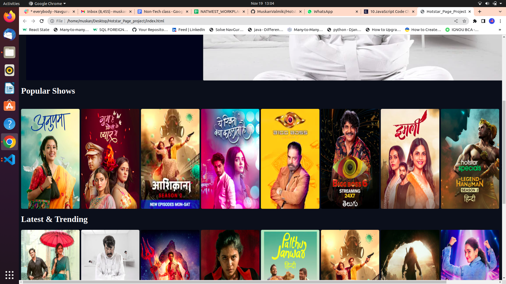

# Hotstar_Page_Project
<<<<<<< HEAD

Improved compatibility of back to top link: See: https://github.com/MuskanValmiki/Hotstar_Page_Project -README-Template

*** Thanks for checking out the README-Template. If you have a suggestion
*** that would make this better, please fork the repo and create a pull request
*** or simply open an issue with the tag "enhancement".
*** Don't forget to give the project a star!
*** Thanks again! Now go create something AMAZING!

PROJECT HOTSTAR_PAGE

*** I'm using hover tag for increasing the image size when we click that image.
*** That is our first project with a team and we learn how to do work with one repo when there is so many people.
*** See the bottom of this document for the declaration of the reference which heading is there in nav bar.

#Preview
*** ![http://127.0.0.1:5500/index.html]

*** Here is demo or out project page how it look like.

=======
I made one blog of Disney+ Hotstar.
In this blog I made 8 pages of movie.
# Preview
![http://127.0.0.1:5500/index.html]

## Muskan Valmikee ,Sukhanya,Aishani,Gudia and Anusha.

#Here I create 3rd blog which is popular shows option.

#If we click that shows image so it increase the size of that image for that I use hover tag.

#I learn so many news thing in html and css like (how we gave to style or our html by using css).

#Here we are five members of team 1.Aishani 2.Sukhanya 3.Muskan Valmikee 4.Anusha 5.Gudia .

#We all learn how to work in team ,how we gave contribution to other and with one repository ,how we all work together in one project.

#We all enjoy,learn and help each others.
>>>>>>> e3e993eb70da49ee747dd637ae9128ca969e4e54
